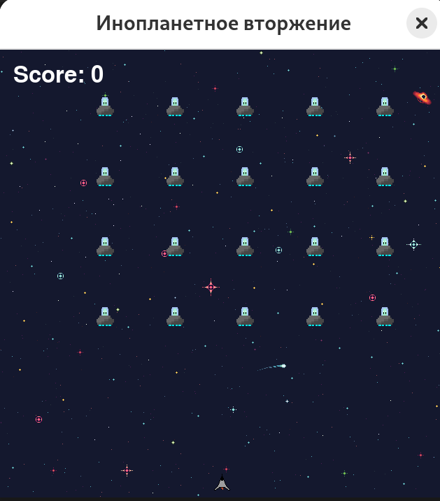

# Alien Invasion Game (Инопланетное Вторжение)

## Описание
Это 2D-игра, в которой игрок управляет космическим кораблём, стреляющим по инопланетным захватчикам. В игре инопланетяне постепенно спускаются вниз и двигаются по экрану, а игрок должен уничтожать их, избегая столкновений с ними. Игра заканчивается, если инопланетянин достигнет нижней границы экрана или если корабль столкнётся с инопланетянином.

## Требования
- Python 3.6+
- Pygame (версии 2.6.1 и выше)

## Установка

1. **Установка зависимостей:**

   Перед запуском игры нужно установить библиотеку Pygame. Для этого используйте следующую команду:

   ```bash
   pip install pygame
   ```

2. **Запуск игры:**

   Для запуска игры просто запустите основной файл `alien_invasion.py`:

   ```bash
   python alien_invasion.py
   ```

## Функциональные возможности

- **Управление кораблём:**
  - Игрок управляет движением корабля вправо и влево с помощью стрелок на клавиатуре.
  - Стрельба осуществляется с помощью клавиши пробела.

- **Инопланетяне:**
  - Инопланетяне двигаются горизонтально и постепенно спускаются вниз.
  - Они меняют направление при достижении края экрана.

- **Конец игры:**
  - Игра заканчивается, если инопланетянин достигает нижней границы экрана или если происходит столкновение с кораблём.

- **Сложность:**
  - С каждым уровнем увеличивается скорость инопланетян и сложность игры.

## Структура проекта

Проект организован в несколько файлов:

- `alien_invasion.py`: Главный файл, который запускает игру.
- `settings.py`: Файл с настройками игры, включая скорость инопланетян и параметры экрана.
- `ship.py`: Класс для создания и управления космическим кораблём.
- `alien.py`: Класс для создания инопланетян.
- `bullet.py`: Класс для создания пуль и их движения.

## Как работает игра

1. Игрок управляет космическим кораблём с помощью стрелок влево и вправо.
2. Космический корабль может стрелять пулями, которые двигаются вверх, уничтожая инопланетян.
3. Инопланетяне движутся вправо и влево, а также опускаются вниз, увеличивая скорость по мере прогресса.
4. Игра заканчивается, если:
   - Корабль сталкивается с инопланетянином.
   - Инопланетянин доходит до нижней границы экрана.

## Задания, реализованные в игре:

1. **Управление кораблём:**
   - Стрелки на клавиатуре для перемещения корабля.
   - Пробел для стрельбы.

2. **Создание флота инопланетян:**
   - Инопланетяне двигаются по экрану и меняют направление при столкновении с краем.

3. **Механизм столкновений:**
   - Столкновение пули с инопланетянином.
   - Столкновение корабля с инопланетянином.

4. **Конец игры:**
   - Игра заканчивается, если инопланетянин достигнет нижней границы экрана или если происходит столкновение с кораблём.

## Дополнительные улучшения (по желанию):

- Добавление таблицы рекордов для хранения лучших результатов.
- Реализация системы уровней, где с каждым уровнем увеличивается скорость инопланетян.
- Добавление звуковых эффектов для выстрелов, уничтожения инопланетян и конца игры.

## Примечания

- Для игры вам понадобятся изображения с прозрачным фоном:
  - `ship.png` для корабля.
  - `alien.png` для инопланетян.

## Бинарник для linux  
build_linux.sh:
```sh
chmod +x build_linux.sh
./build_linux.sh
```

Пример работы:   
