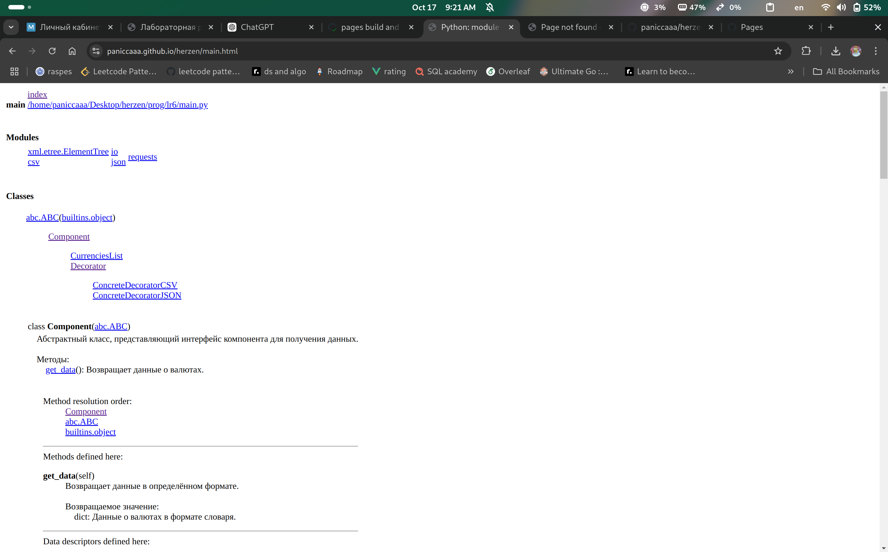
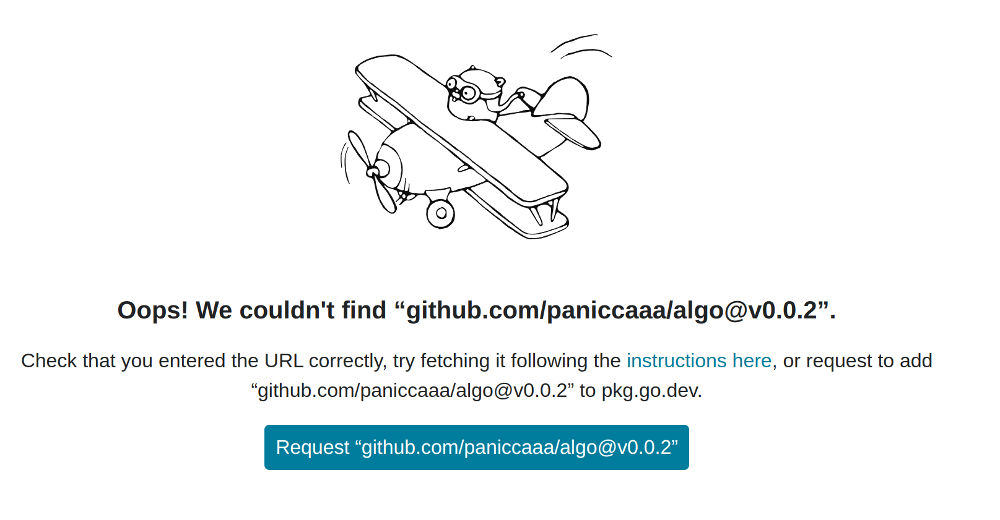
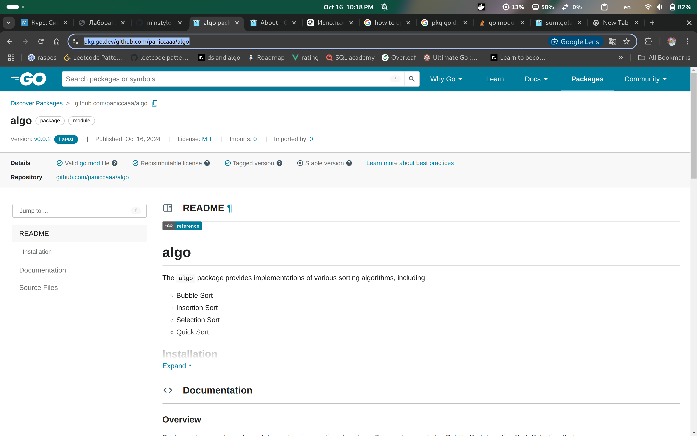

# Лабораторная работа 4: Pydoc & Golang
## Адаменко Семён Сергеевич, ИВТ 2.1

## Введение
В данной лабораторной работе изучаются методы генерации документации для программных проектов с использованием Python и Golang. Основное внимание уделяется инструментам Pydoc для Python и стандартным методам документирования в Golang. Цели работы включают изучение процесса написания документации, её генерацию и публикацию на GitHub Pages.

## Ход работы
### 1) Python и Pydoc
1. Лабораторная работа 6 по программированию.
2. Пример docstring в коде: 
   [main](/prog/lr6/main.py)
3. Используем команду для генерации документации: 
   ```bash
   pydoc -w main
   ```
4. Настройка GitHub Pages на директорию `/docs`.
5. Получение документации.

   

### 2) Golang
1. Мини-проект с реализацией различных видов сортировок.
2. Примеры документации пакета и функции:
   
   **Пакет:**
   ```go
   // Package algo предоставляет реализации различных алгоритмов сортировки.
   // В этот пакет входят алгоритмы пузырьковой сортировки, сортировки вставками,
   // сортировки выбором и быстрой сортировки для сортировки массивов целых чисел по возрастанию.
   package algo
   ```

   **Функция:**
   ```go
   // QuickSort сортирует массив целых чисел с помощью алгоритма быстрой сортировки.
   // Этот алгоритм работает, выбирая "опорный" элемент из массива
   // и разбивая другие элементы на два подмассива: те, что меньше
   // опорного, и те, что больше. Подмассивы затем сортируются рекурсивно,
   // что делает быструю сортировку одним из самых эффективных
   // алгоритмов сортировки для больших наборов данных.
   func QuickSort(arr []int, low, high int) {
       if low < high {
           // Разбиваем массив и получаем индекс опорного элемента
           pi := partition(arr, low, high)

           // Рекурсивно сортируем элементы до и после разделения
           QuickSort(arr, low, pi-1)
           QuickSort(arr, pi+1, high)
       }
   }
   ```

3. Перед публикацией документации необходимо выложить исходный код на GitHub и выставить лицензию. Также стоит отметить, что документация поддерживает версионирование, как и репозиторий.
4. Перейти на страницу [https://pkg.go.dev/](https://pkg.go.dev/) и в поиске ввести путь до написанного модуля — обычно это путь до репозитория на GitHub.
5. Далее просто запрашиваем нашу документацию.

   

6. Получаем готовую документацию [https://pkg.go.dev/github.com/paniccaaa/algo](https://pkg.go.dev/github.com/paniccaaa/algo).

   

## Выводы
В ходе лабораторной работы были изучены инструменты для генерации документации для проектов на Python и Golang. 

### Сравнение инструментов:
- **Pydoc** позволяет быстро генерировать документацию для Python-кода, что особенно полезно для небольших проектов.
- **Golang** предлагает встроенные стандарты для написания комментариев, которые поддерживаются в инструментах для генерации документации, таких как `pkg.go.dev`. Это упрощает процесс документирования и делает его более унифицированным.

### Анализ важности документации:
Документация является неотъемлемой частью разработки программного обеспечения. Она помогает другим разработчикам и пользователям понять, как использовать и поддерживать код, что особенно важно в командной работе.

### Баланс между документированием и самодокументирующимся кодом:
Необходимость в документировании зависит от сложности проекта. Самодокументирующийся код — это хороший подход, однако полная и структурированная документация все равно остается важной для понимания логики и функционала приложения.

## Ссылки
1. Python: https://paniccaaa.github.io/herzen/
2. Golang: https://pkg.go.dev/github.com/paniccaaa/algo
3. Руководство по написанию документации Python: https://sphinxcontrib-napoleon.readthedocs.io/en/latest/example_google.html
4. Официальный гайд от авторов языка о правильном написании комментариев: [Go Comment Guide](https://go.dev/doc/comment).
