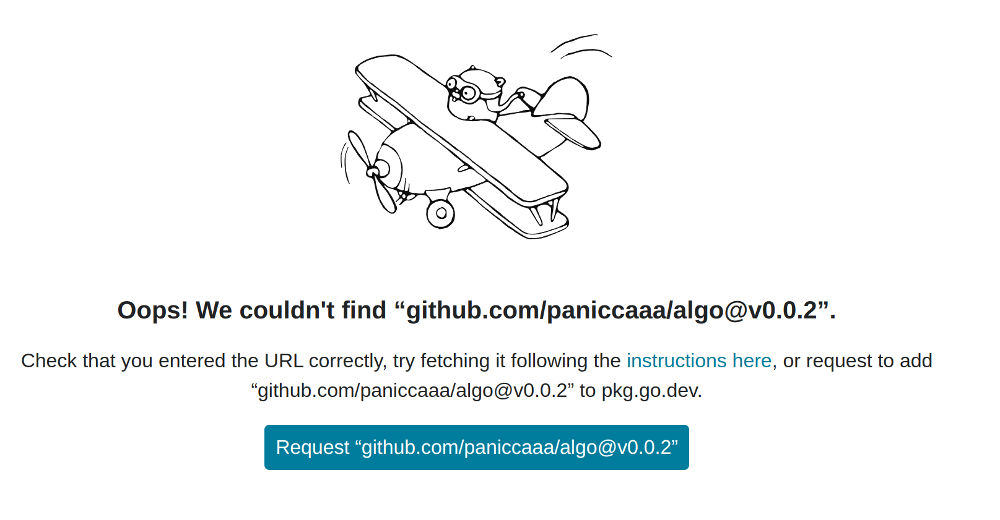
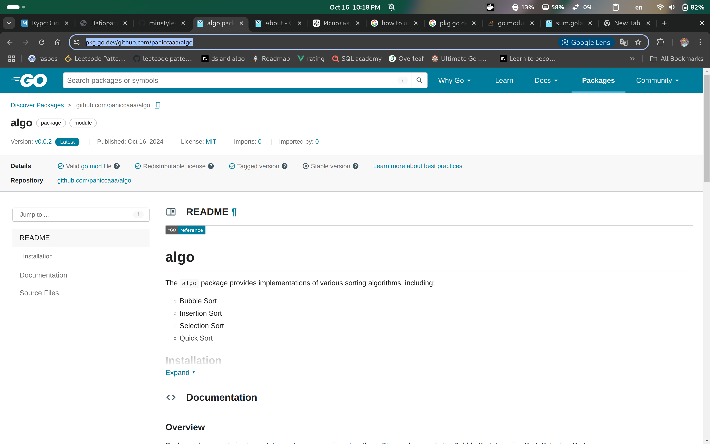

# Лабораторная работа 4, Pydoc & Golang
## Адаменко Семён Сергеевич, ИВТ 2.1

## Введение

## Ход работы
### 1) Python и Pydoc
1. Лабораторная работа 6 по программированию
2. Пример docstring в коде: 
[main](/prog/lr6/main.py)
3. Используем команду ```pydoc -w main```
### 2) Golang
1. Мини-проект с реализацией разных видов сортировок
2. Официальный гайд от авторов языка как правильно писать комментарии - https://go.dev/doc/comment. 

Примеры документации пакета и функции:
Пакет: 
```go
// Package algo provide implementations of various sorting algorithms.
// This package includes Bubble Sort, Insertion Sort, Selection Sort,
// and Quick Sort algorithms to sort arrays of integers in ascending order.
package algo
```
Функция:
```go

// QuickSort sorts an array of integers using the quicksort algorithm.
// This algorithm works by selecting a "pivot" element from the array
// and partitioning the other elements into two subarrays: those less than
// the pivot and those greater than the pivot. The subarrays are then
// sorted recursively. This makes quicksort one of the most efficient
// sorting algorithms for large datasets.
func QuickSort(arr []int, low, high int) {
	if low < high {
		// Partition the array and get the pivot index
		pi := partition(arr, low, high)

		// Recursively sort elements before and after partition
		QuickSort(arr, low, pi-1)
		QuickSort(arr, pi+1, high)
	}
}
```
3) Перед тем как опубликовать документацию необходимо выложить исходный код на GitHub, и выставить лицензию. Также стоит отметить, что документация поддерживает версионирование, как и репозиторий 
4) Перейти на страницу https://pkg.go.dev/ и в поиске вписать модуль который мы написали - практически всегда это путь до репозитория в GitHub
5) Далее просто запрашиваем нашу документацию

6) Получаем готовую документацию https://pkg.go.dev/github.com/paniccaaa/algo 


## Выводы:

## Ссылки
1) Python: 
2) Golang: https://pkg.go.dev/github.com/paniccaaa/algo 