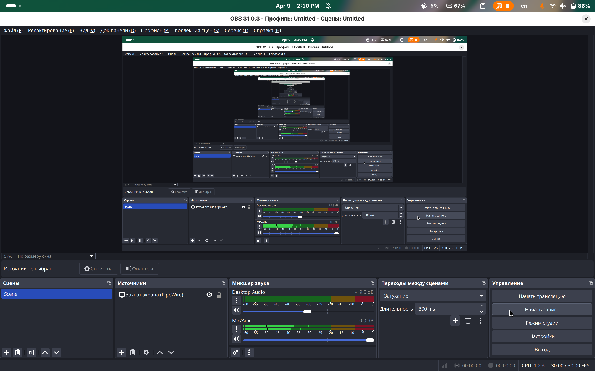

### **Сценарий скринкаста**

**Тема:** _Влияние длительной работы за компьютером на здоровье и значение регулярных физических упражнений в профилактике профессиональных заболеваний_

---

#### **Цель скринкаста**

Целью данного скринкаста является формирование у пользователей осознанного отношения к необходимости регулярных физических упражнений в процессе длительной работы за компьютером. В рамках видео демонстрируются основные риски малоподвижного образа жизни и приводятся примеры простых, но эффективных упражнений, направленных на поддержание здоровья опорно-двигательного аппарата и органов зрения.

---

#### **Целевая аудитория**

Сотрудники, осуществляющие профессиональную деятельность в условиях продолжительной работы за компьютером, студенты, а также иные пользователи, проводящие значительное количество времени в сидячем положении.

---

#### **Продолжительность скринкаста:**

Ориентировочно 3 минуты.

---

#### **Сценарный план**

**1. Вступление (0:00 – 0:20)**  
– Формулировка проблемы:

> «Современная профессиональная деятельность всё чаще предполагает длительное пребывание за компьютером. Это влечёт за собой физиологические нагрузки, способные привести к развитию хронических заболеваний. В настоящем скринкасте будет рассмотрено, какие риски сопровождают такую работу и какие меры профилактики позволяют сохранить здоровье.»

---

**2. Основные риски сидячей работы (0:20 – 0:50)**  
– Краткое перечисление последствий:  
- Нарушение осанки  
- Повышенная утомляемость  
- Миофасциальные боли в области шеи и спины  
- Снижение подвижности суставов  
- Повышенное зрительное напряжение

> «Длительное статичное положение тела без активных перерывов ведёт к ухудшению кровообращения, напряжению в определённых группах мышц и снижению общей работоспособности.»

---

**3. Теоретическое обоснование необходимости двигательной активности (0:50 – 1:10)**  
– Обоснование с точки зрения медицины и эргономики труда

> «По данным Всемирной организации здравоохранения, для сохранения здоровья при работе за компьютером необходимо делать активные перерывы не реже одного раза в час. Даже кратковременная физическая активность улучшает метаболизм, активизирует мозговую деятельность и снижает риск профессиональных заболеваний.»

---

**4. Демонстрация упражнений (1:10 – 2:30)**  
– Видео-демонстрация простых упражнений с голосовым комментарием:  
1. Круговые движения плечами (10–15 повторений)  
2. Плавные наклоны головы вперёд-назад и в стороны  
3. Растяжка мышц шеи путём аккуратного нажатия рукой  
4. Растяжение запястий и пальцев рук  
5. Лёгкие приседания или ходьба по комнате  
6. Упражнение для глаз: метод «20-20-20» (каждые 20 минут смотреть на объект на расстоянии 6 метров в течение 20 секунд)

> «Каждое из этих упражнений может быть выполнено без отрыва от рабочего процесса и не требует специального оборудования.»

---

**5. Заключение (2:30 – 3:00)**

> «Физическая активность в течение рабочего дня — это не дополнительная опция, а необходимая мера профилактики, напрямую влияющая на качество жизни и профессиональную эффективность. Внедрение элементарных привычек может существенно снизить риск заболеваний, связанных с малоподвижным образом жизни.»

> «Рекомендуется внедрять культуру активных перерывов в повседневную практику как на индивидуальном, так и на организационном уровне.»

---

#### **Сравнительная таблица**

|Характеристика|OBS Studio|Bandicam|Снимок экрана (macOS)|
|---|---|---|---|
|**Платформа**|Windows, macOS, Linux|Только Windows|Только macOS|
|**Бесплатность**|Полностью бесплатна|Условно бесплатна (водяной знак в демо)|Полностью бесплатна|
|**Установка**|Требуется установка|Требуется установка|Встроена в систему|
|**Простота использования**|Низкая (много настроек)|Средняя|Высокая|
|**Возможности записи**|Профессиональный уровень (многопоточная запись, сцены, стриминг)|Запись видео и игр, высокая производительность|Только базовая запись экрана и звука|
|**Редактирование видео**|Отсутствует (нужно стороннее ПО)|Базовое (обрезка, эффекты)|Отсутствует|
|**Поддержка стриминга**|Есть|Нет|Нет|
|**Язык интерфейса**|Русский/английский и др.|Русский/английский|Русский/английский|
|**Поддержка горячих клавиш**|Есть|Есть|Есть|

---

#### **Вывод и обоснование выбора**

В результате анализа были рассмотрены три программы, отличающиеся уровнем сложности, функциональностью и совместимостью с различными операционными системами. Несмотря на наличие альтернатив с более упрощённым интерфейсом, выбор пал на **OBS Studio** ввиду её богатых возможностей и гибкости настройки, что особенно важно для создания качественных обучающих материалов и демонстрационных видео.

Данное решение обусловлено следующими факторами:

- **Расширенные возможности настройки.** OBS Studio позволяет детально регулировать параметры записи, трансляции, а также сочетать множество источников видео и аудио. Это даёт возможность адаптировать запись под конкретные задачи, включая работу с различными сценами, наложениями, эффектами и кастомными переходами.
    
- **Поддержка мультиканального звука.** Программа обеспечивает интеграцию не только микрофонного звука, но и аудио из системных источников, что способствует созданию качественного контента, где важны как голосовые комментарии, так и качественное звуковое оформление.
    
- **Кроссплатформенность.** OBS Studio доступна для Windows, macOS и Linux, что позволяет использовать её на различных устройствах. Это особенно актуально для пользователей, работающих в смешанных программных средах.
    
- **Гибкость и масштабируемость.** Благодаря открытой архитектуре и активному сообществу разработчиков, OBS Studio предлагает широкий спектр плагинов и дополнений. Это позволяет наращивать функциональность под индивидуальные потребности, а также внедрять обновления и новые возможности, не прибегая к смене программного обеспечения.
    
- **Бесплатное и открытое ПО.** OBS Studio распространяется под открытой лицензией, что гарантирует отсутствие финансовых затрат на использование и доступ к исходному коду для желающих внести улучшения или адаптировать программу под свои нужды.
    

Таким образом, выбор программы **OBS Studio** соответствует цели создания качественных обучающих и демонстрационных видео за счёт богатого функционала, гибкости настройки и возможности работы с различными источниками медиа, что позволяет получать высококачественный результат даже для сложных задач.
# 3:
Нажимаем на "начать запись"

