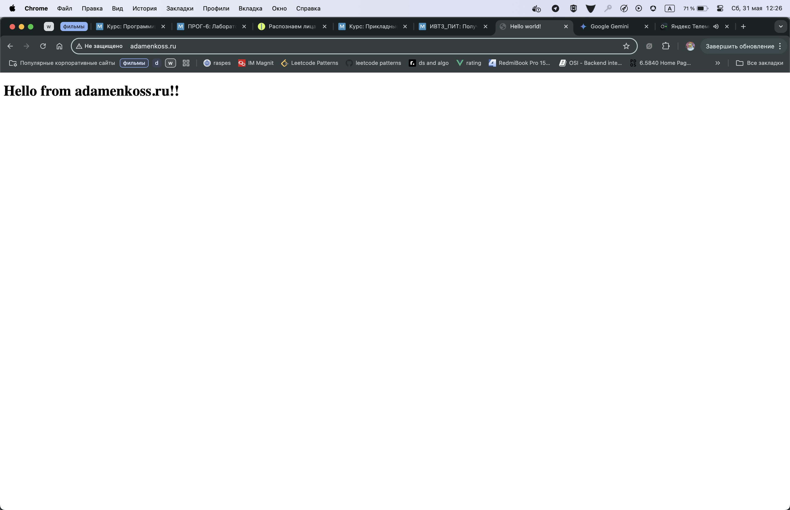
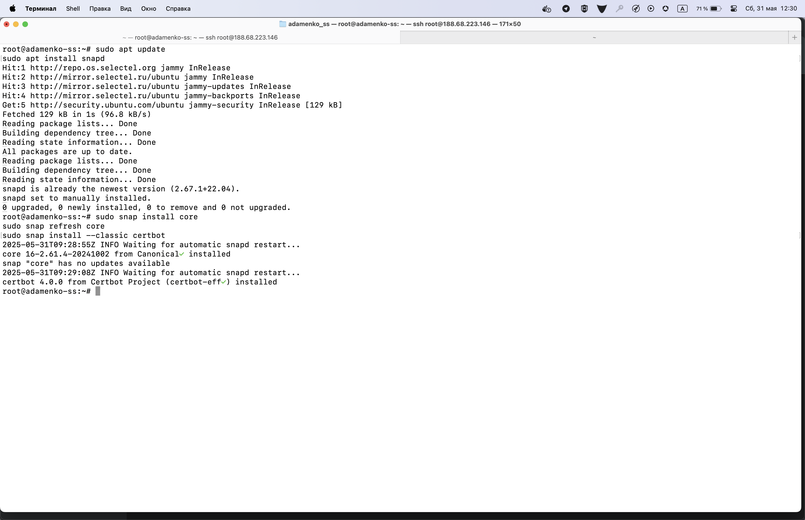
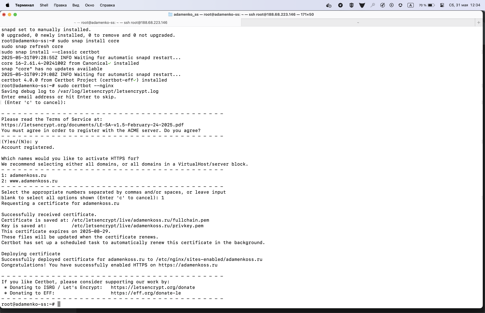
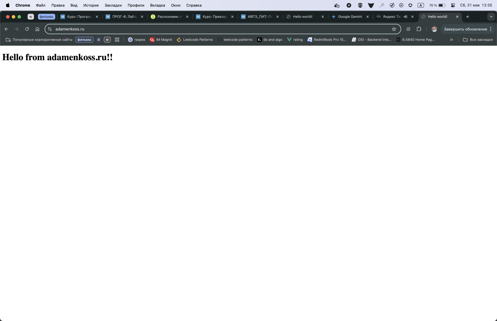
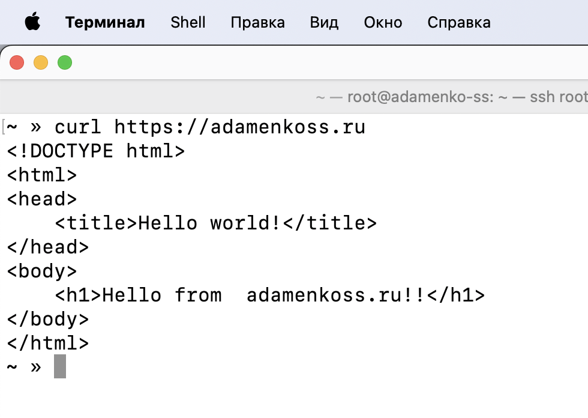

# Адаменко Семён Сергеевич, ИВТ 2.1

1) Настроено доменное имя для ip-адреса сервиса

2) Установка certbot и создание симв. ссылки, чтобы Certbot был доступен из CLI

3) Выбор стратегии Challenge и генерация сертификатов

4) Готово! Теперь наш nginx использует https

