# Адаменко Семён Сергеевич, ИВТ 2.1

1) Создание сервера ubuntu 
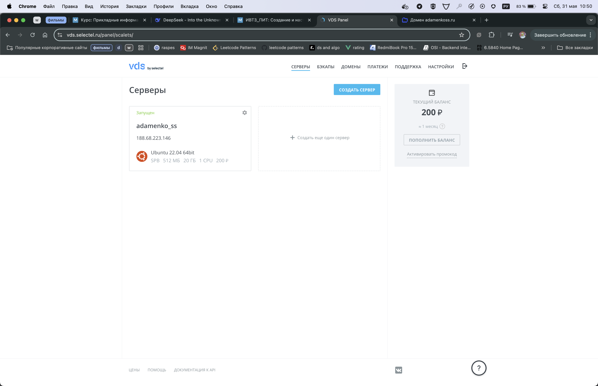

2) Регистрация домена
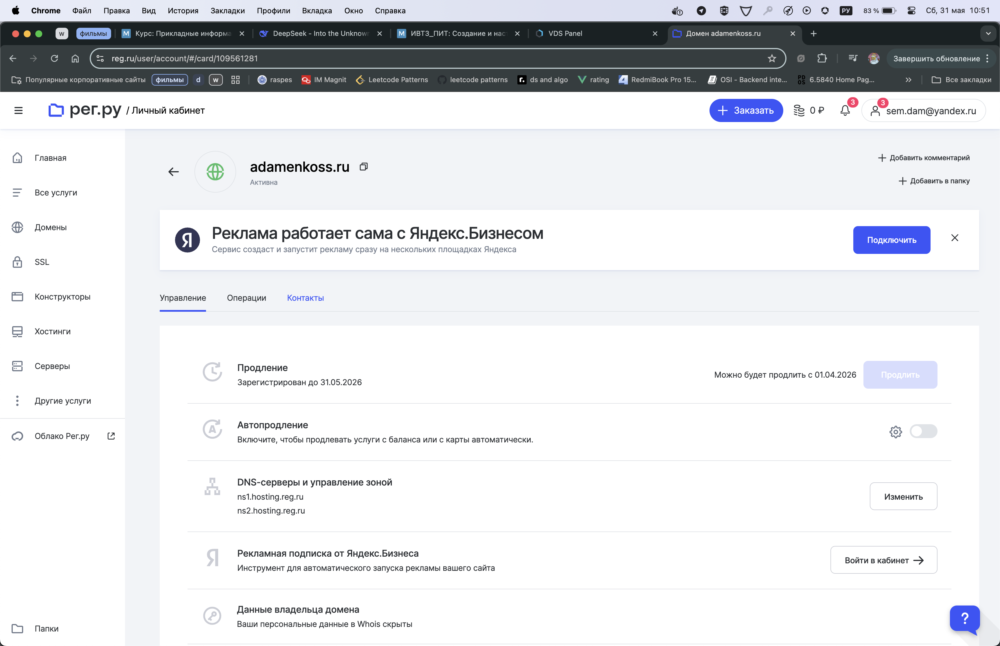

3) Подключение по ssh 
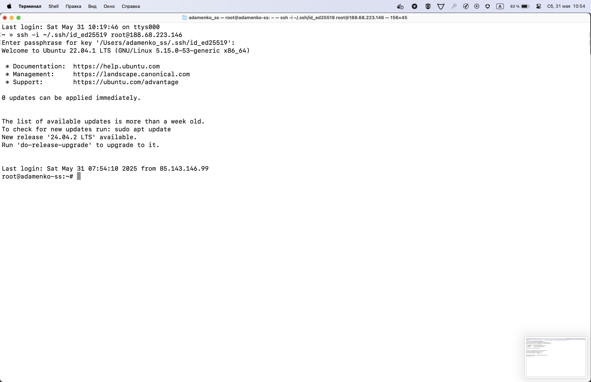

4) Обновление пакет update && upgrade
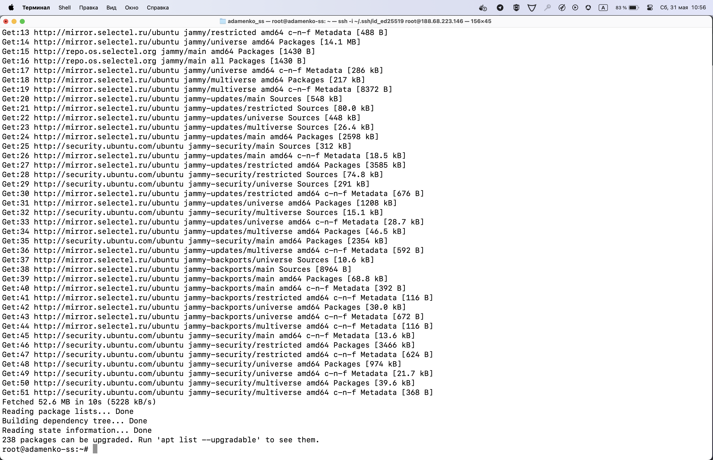
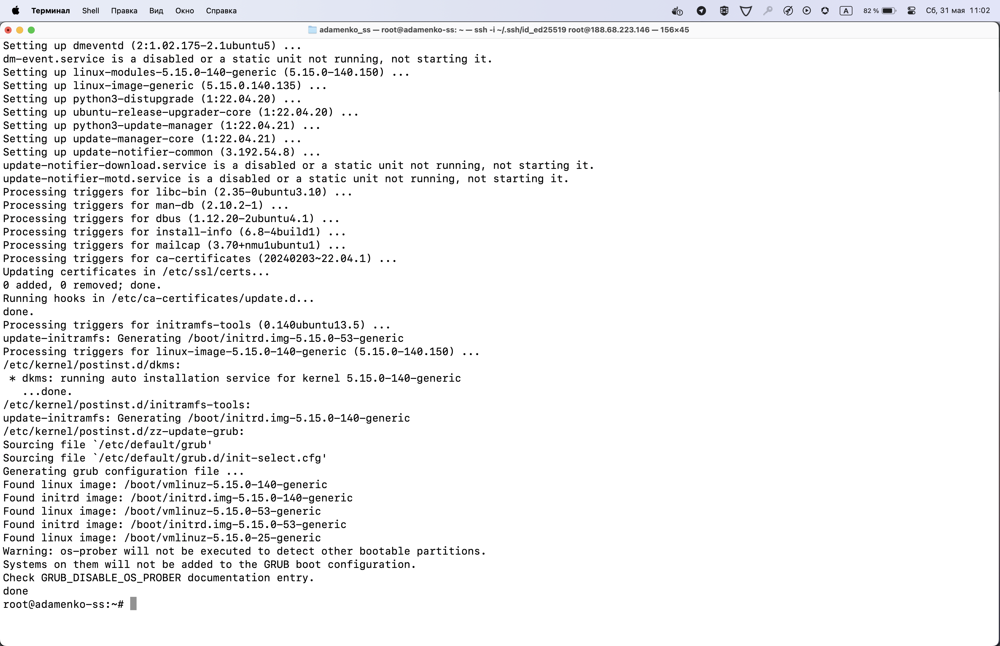

5) Установка nginx 
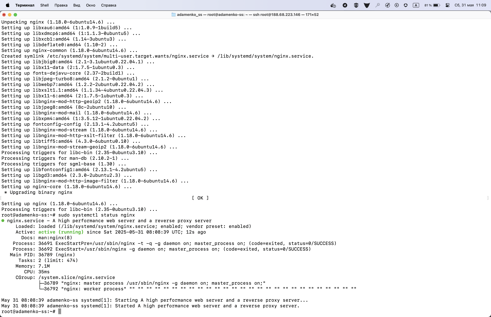

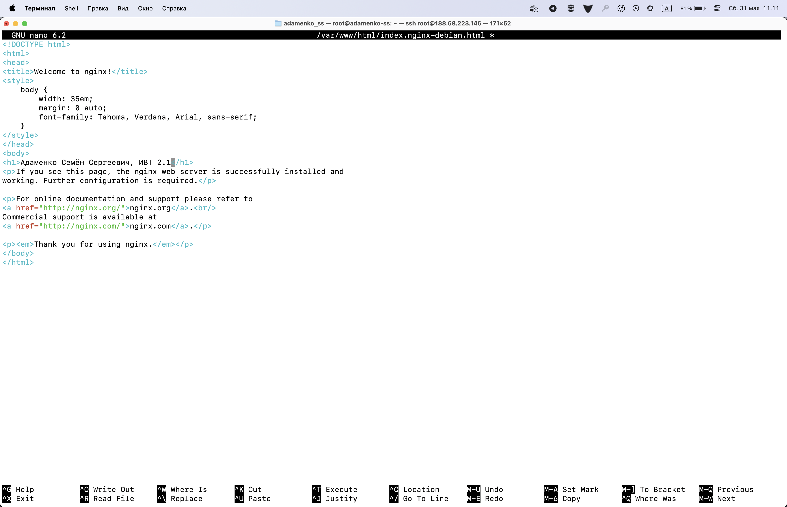

6) Добавление ip адрес сервера к домену
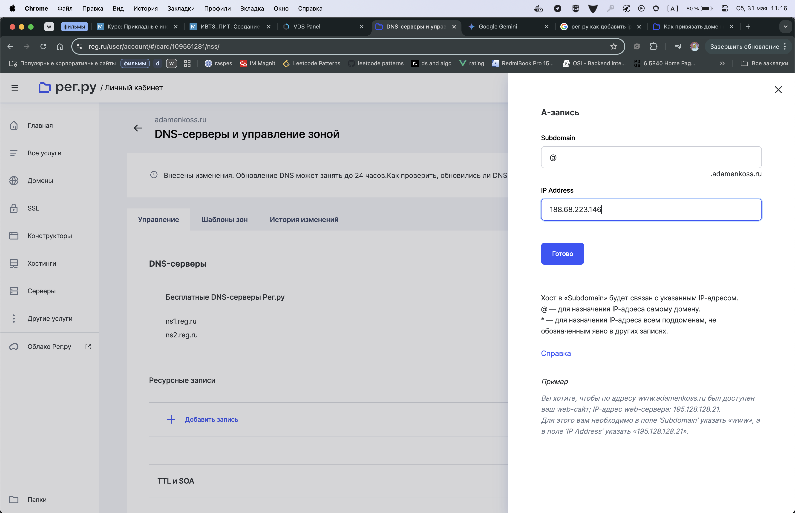

- Конфигурационный файл nginx для домена 
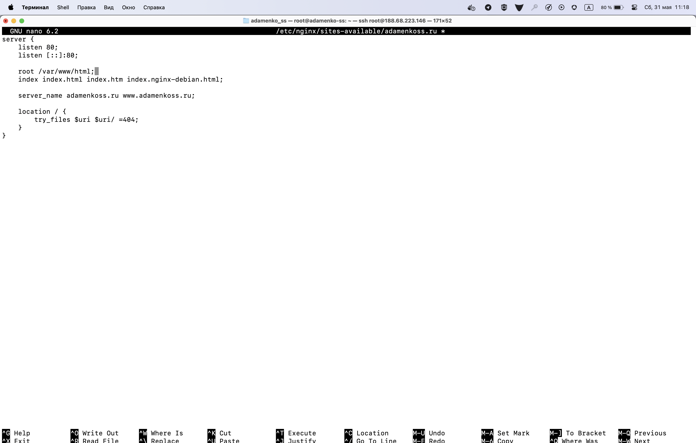

7) Открытая страница в браузере
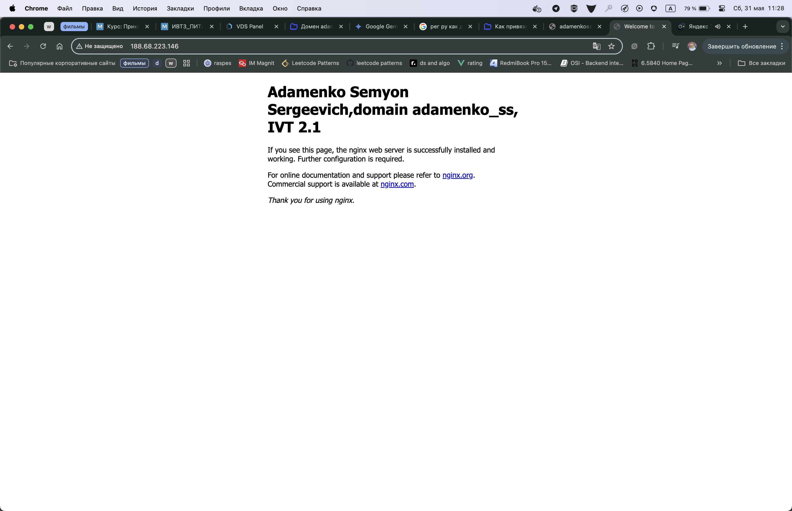

8) Проверка через консоль 
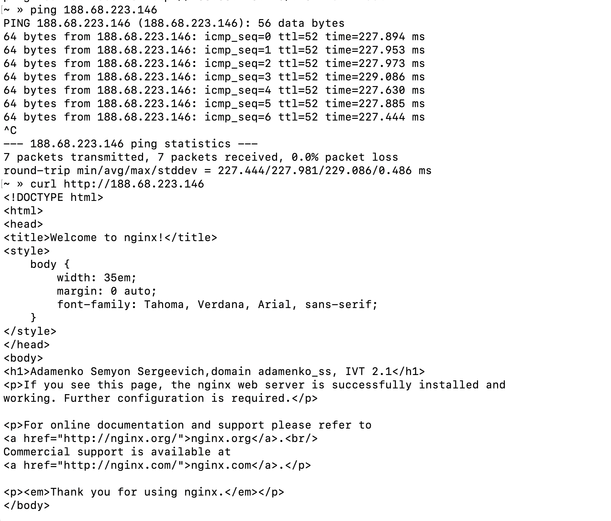

Домен для ip еще не распространился