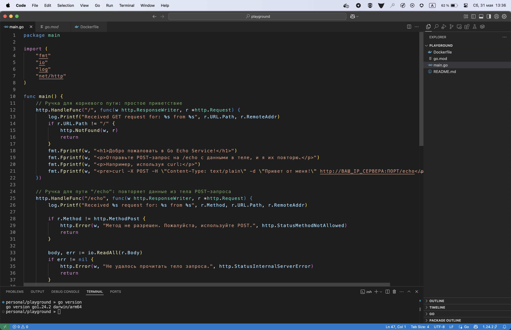
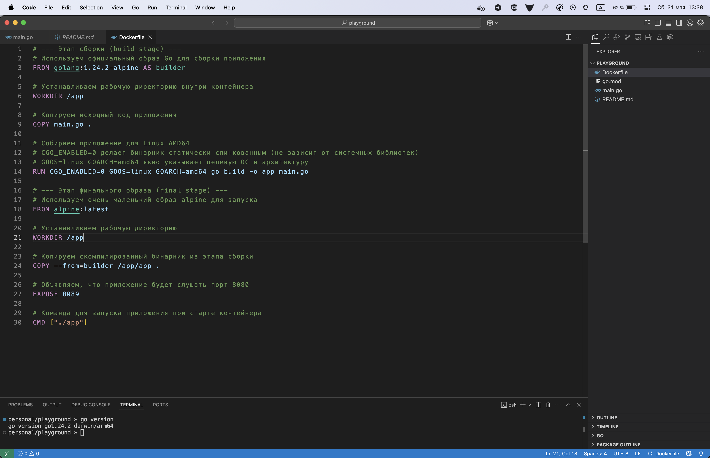
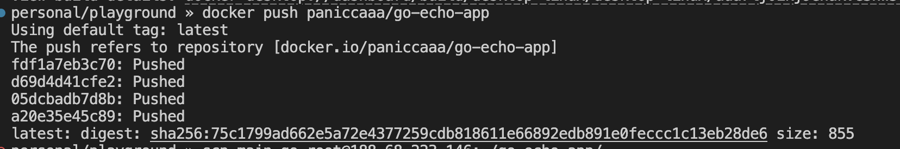
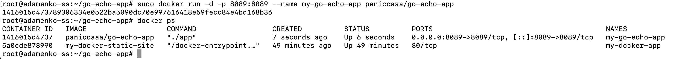
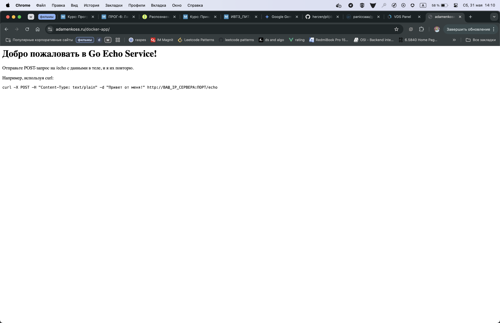
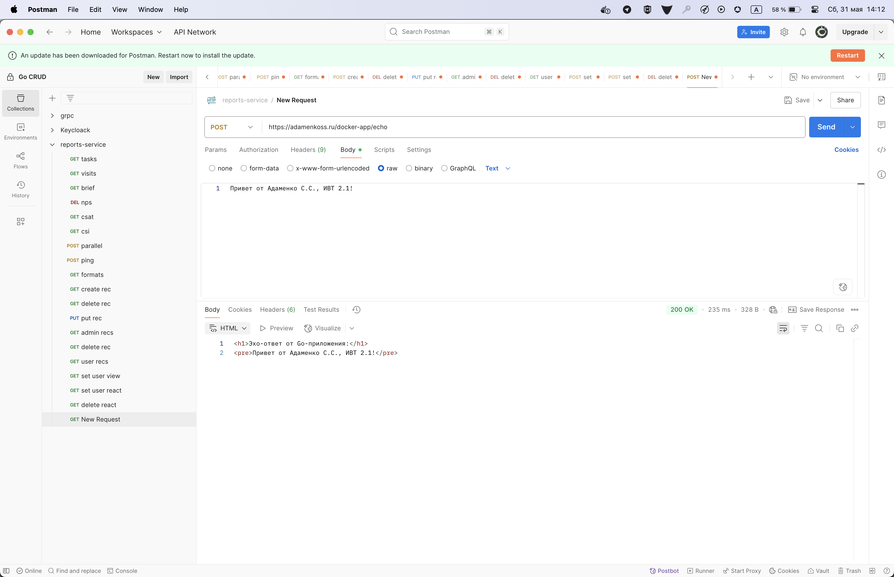

# Адаменко Семён Сергеевич, ИВТ 2.1

1) Пишем приложение на Golang с двумя простыми ручками

2) Также делаем Dockerfile под amd64

- Пуши на docker.hub

3) После pull и настройки nginx конфига на проксирование к контейнеру запускаем на удаленном сервере 

4) Теперь нам доступно приложение написанное на Go через браузер:

5) Проверка работоспособности POST запроса

DockerHub ссылка:
https://hub.docker.com/repository/docker/paniccaaa/go-echo-app/general