Работу выполнил:
Адаменко Семён, ИВТ 2.1

Результаты работы:
- https://adamenkoss.ru/go-ping-pong-2/

- https://adamenkoss.ru/go-ping-pong-1/

1) Написание пинг-понг приложения 
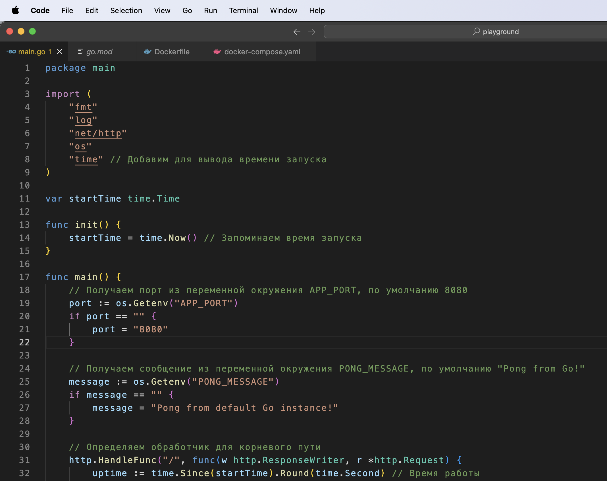

2) Dockerfile
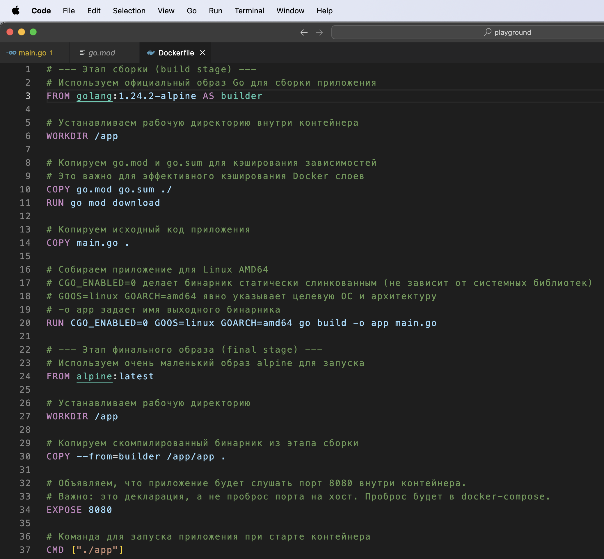

3) Docker-compose
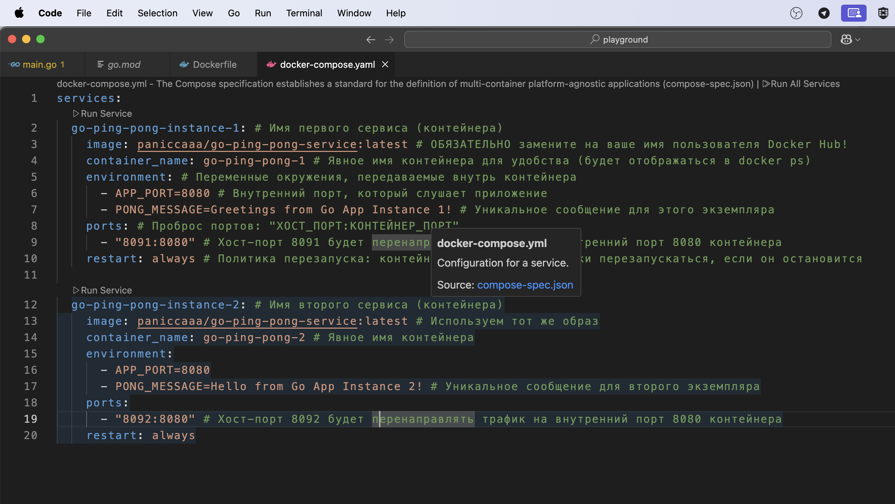

4) Билд и пуш образа на docker hub
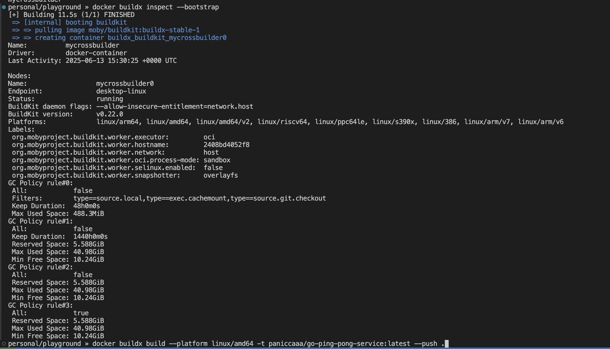
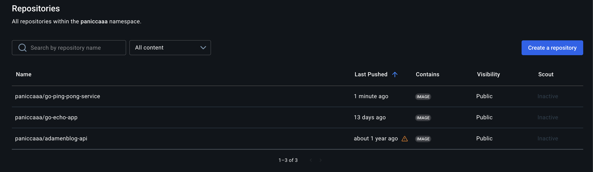

5) Создание директории и копирование docker-compose
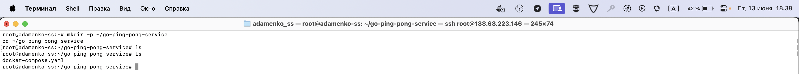
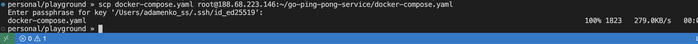

6) Запуск docker-compose на удаленном сервере и локальная проверка
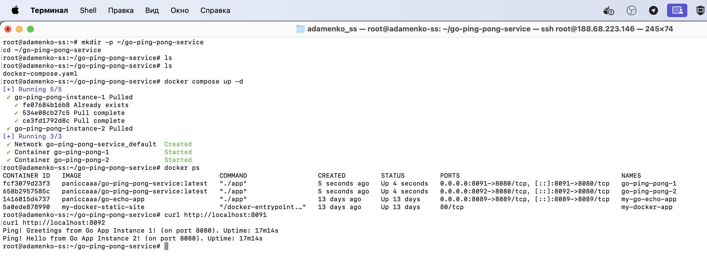

7) Прокидка портов + добавление новых роутов для двух наших приложений 
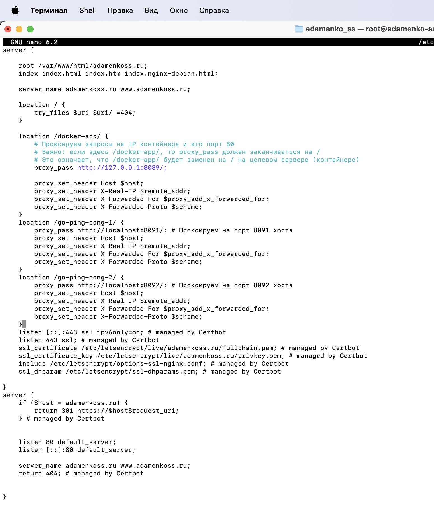
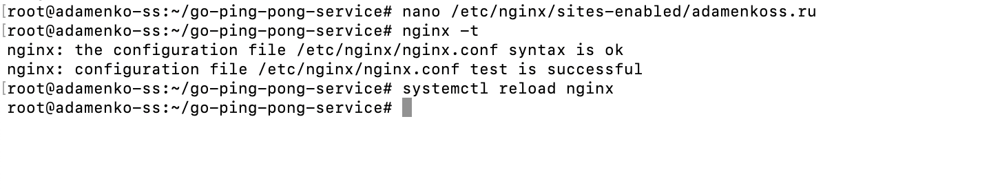

8) Теперь оба приложения доступны извне 
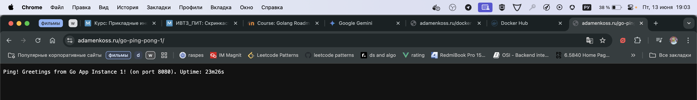
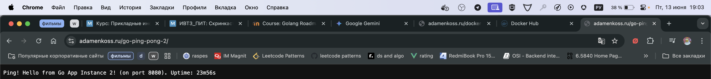