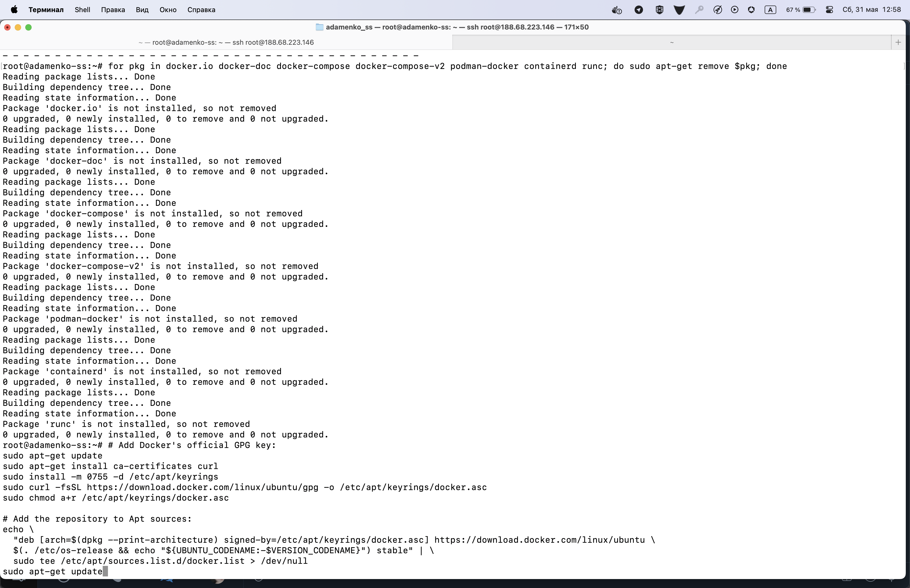
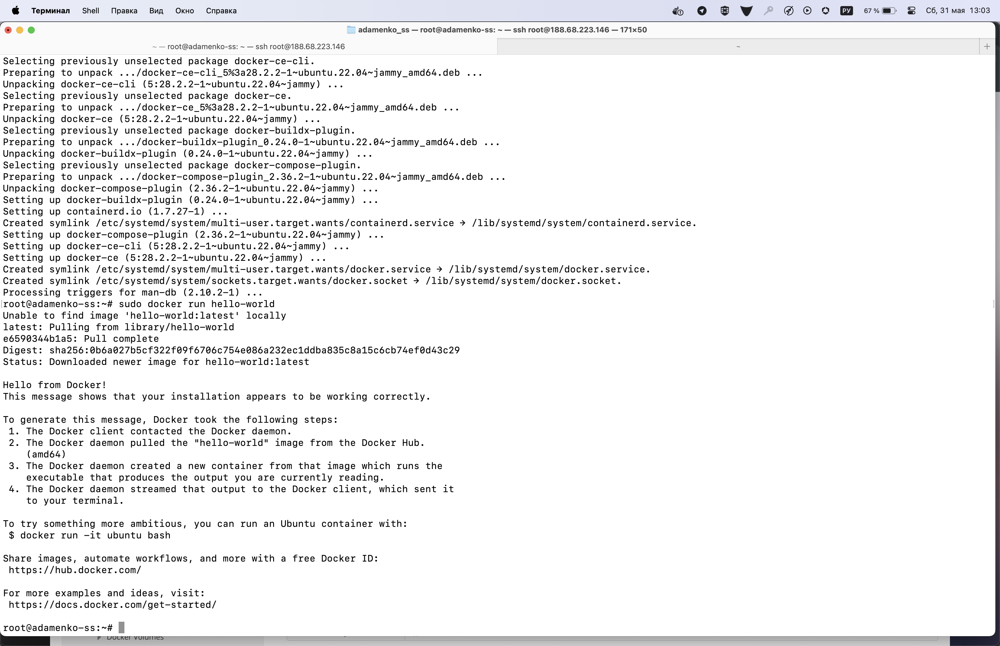
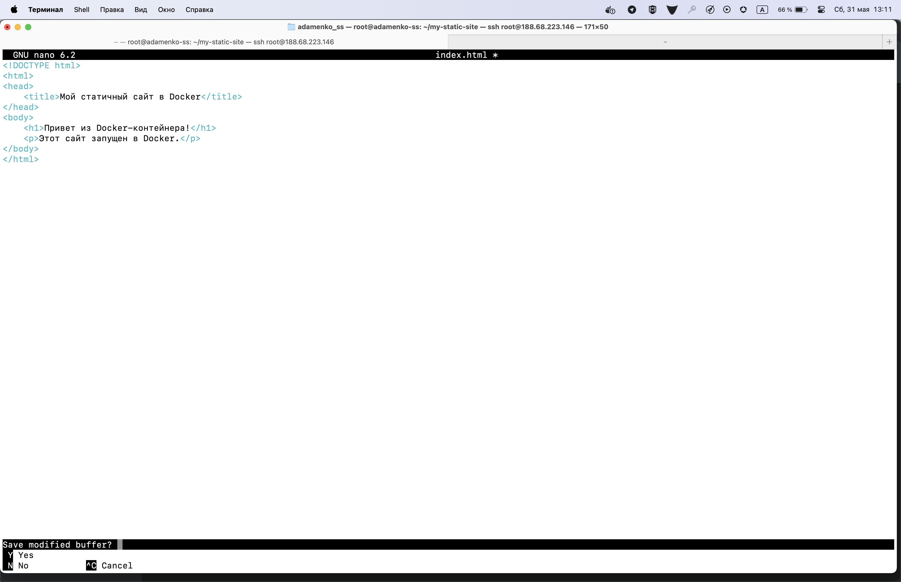
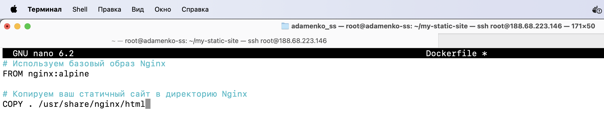
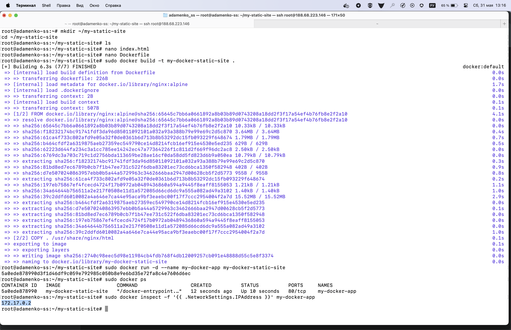
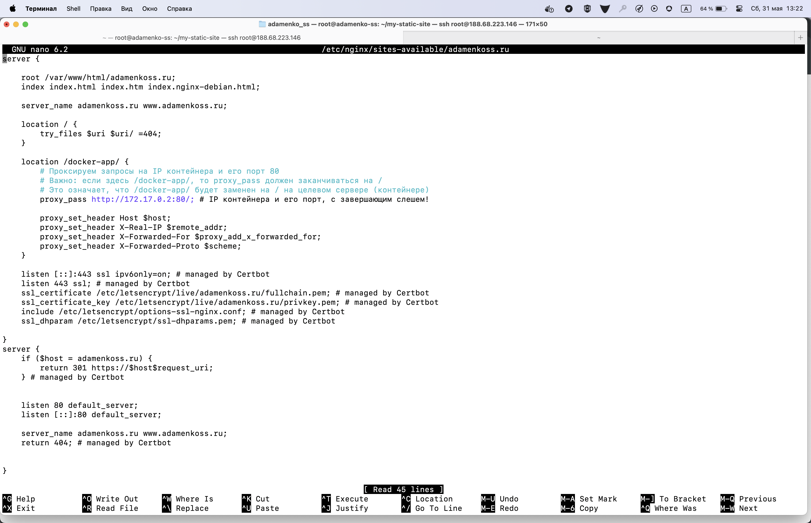
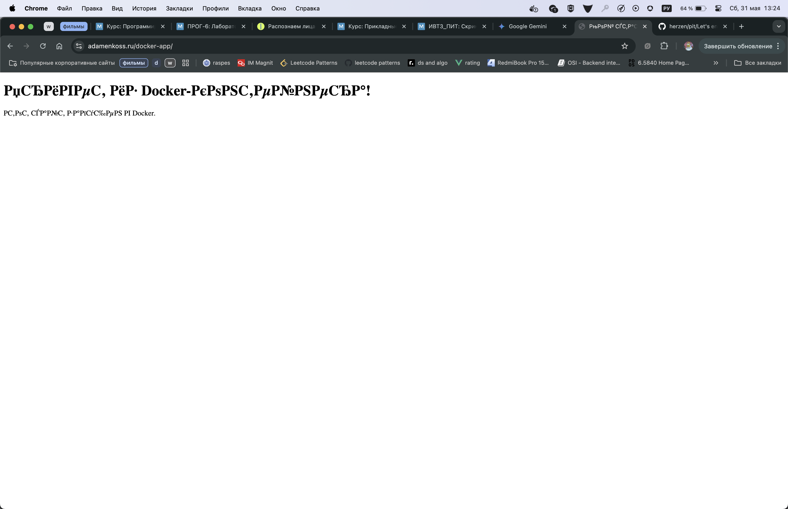
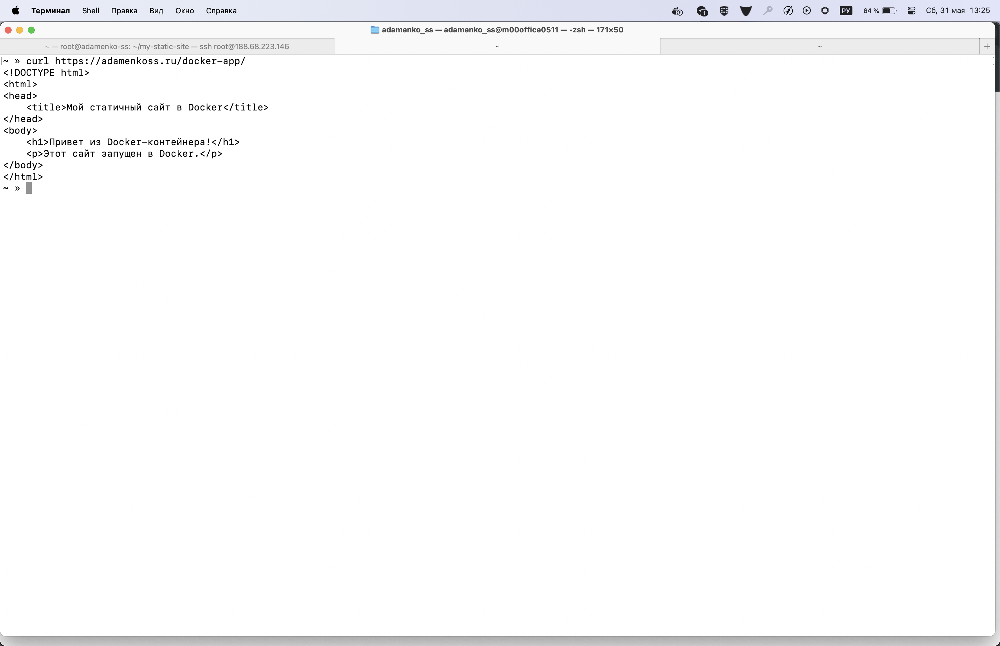

# Адаменко Семён Сергеевич, ИВТ 2.1

1) установка docker на сервер 

2) проверка работоспособности

3) Создание статичного сайта с html страницей

dockerfile для nginx контейнера

4) Билд Dockerfile и запуск контейнера + последующая настройка nginx как обратного прокси на контейнер

5) В браузере получаем

в консоли более правильный вывод, который задумывался
