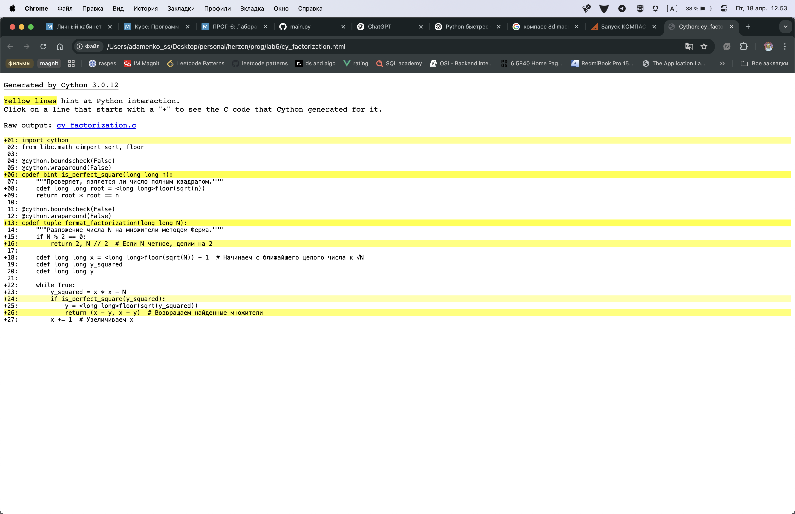
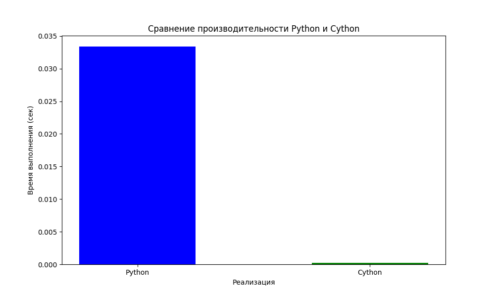
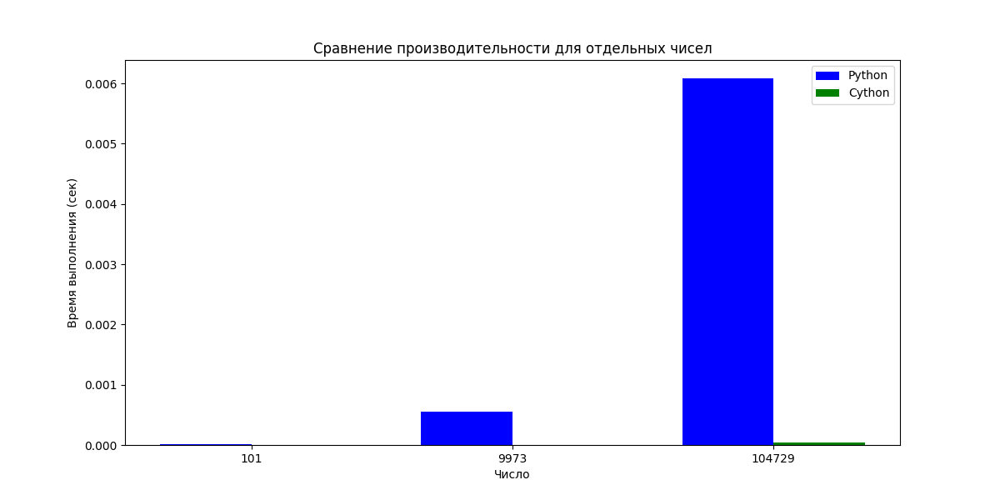

# Лабораторная работа 6 - Оптимизация с помощью Cython

## Шаг 1: Оптимизация алгоритма факторизации Ферма

В данной лабораторной работе реализована оптимизация алгоритма факторизации чисел методом Ферма с использованием Cython.

## Для запуска необходимы следующие зависимости:

## Установка зависимостей:
```bash
pip install cython matplotlib numpy
```

## Запуск сравнения производительности:
1. Сначала нужно скомпилировать Cython модуль:
```bash
python setup.py build_ext --inplace
```

2. Запустить сравнение (этот шаг также автоматически компилирует Cython модуль, если он еще не скомпилирован):
```bash
python compare_performance.py
```

## Файлы проекта:
- `main.py` - исходная Python-реализация
- `cy_factorization.pyx` - Cython-реализация
- `setup.py` - скрипт для компиляции Cython модуля
- `compare_performance.py` - скрипт для сравнения производительности и построения графика

## Результаты:
```sh
venvprog/lab6 » python compare_performance.py
Компиляция Cython модуля...
running build_ext
copying build/lib.macosx-14.0-arm64-cpython-313/cy_factorization.cpython-313-darwin.so -> 
Проверка корректности...
Измерение времени выполнения...
Время выполнения Python: 0.03338 секунд
Время выполнения Cython: 0.00021 секунд
Ускорение: 162.02x
/Users/adamenko_ss/Desktop/personal/herzen/prog/lab6/compare_performance.py:100: UserWarning: Tight layout not applied. The bottom and top margins cannot be made large enough to accommodate all Axes decorations.
  plt.tight_layout()

Тестирование отдельных чисел:

Тестирование числа: 101
Python: 0.00001 сек, результат: (1, 101)
Cython: 0.00000 сек, результат: (1, 101)
Ускорение: 3.54x

Тестирование числа: 9973
Python: 0.00055 сек, результат: (1, 9973)
Cython: 0.00000 сек, результат: (1, 9973)
Ускорение: 128.11x

Тестирование числа: 104729
Python: 0.00608 сек, результат: (1, 104729)
Cython: 0.00004 сек, результат: (1, 104729)
Ускорение: 155.60x
```

### Общее сравнение Python и Cython


### Сравнение по отдельным числам

