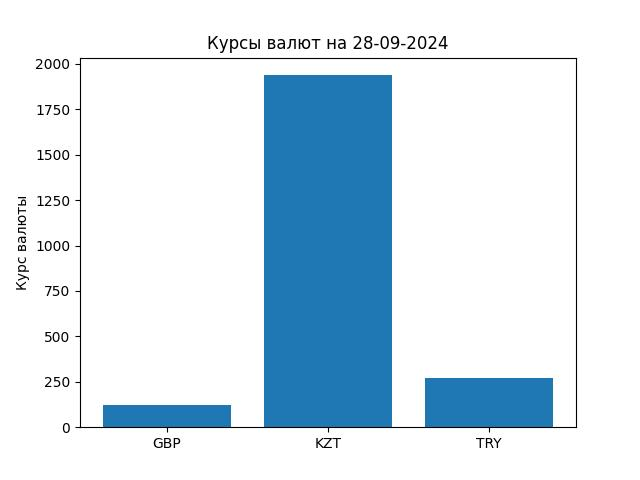

# Лабораторная работа 5 "Получение курсов валют (ООП)"
## Работу выполнил: Адаменко Семён Сергеевич, ИВТ 2.1

Комментарии приложены в самом коде

1) Основной main файл c выполненным заданием (в нём же и тесты с комментариями)
[main](./main.py)

2) Сохраненное изображение
